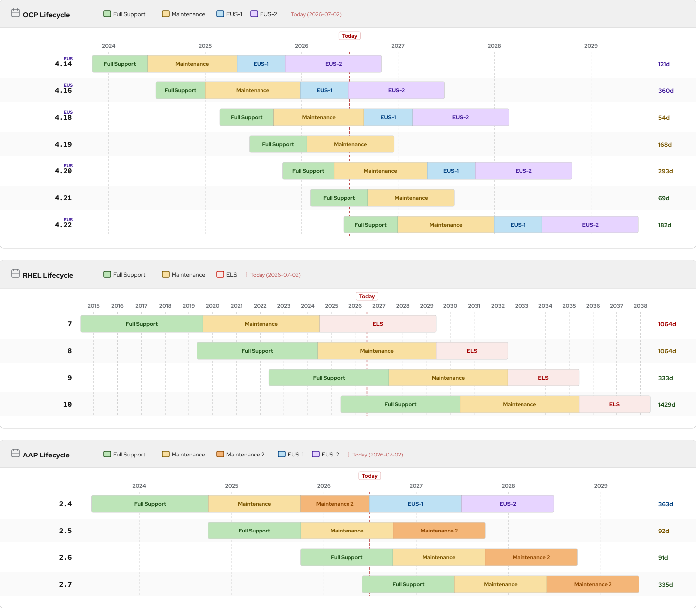

# lifecycle-graph

Standalone Python script that generates Red Hat product lifecycle Gantt charts (OCP, RHEL, AAP) as HTML and PNG.

**No pip dependencies** — uses only stdlib (`urllib`, `json`, `argparse`).  
PNG export requires `rsvg-convert` (`brew install librsvg` / `apt install librsvg2-bin`).

## Preview



Per-product: [lifecycle-ocp.png](generated/lifecycle-ocp.png) · [lifecycle-rhel.png](generated/lifecycle-rhel.png) · [lifecycle-aap.png](generated/lifecycle-aap.png)

## Usage

```bash
# OCP (default)
python3 lifecycle-graph.py --png

# RHEL
python3 lifecycle-graph.py --product rhel --png

# AAP
python3 lifecycle-graph.py --product aap --png

# All products at once → lifecycle-ocp.*, lifecycle-rhel.*, lifecycle-aap.*
python3 lifecycle-graph.py --product all --png

# Version range (per product format)
python3 lifecycle-graph.py --product ocp  --from 4.18 --to 4.22 --png
python3 lifecycle-graph.py --product rhel --from 8 --to 10 --png
python3 lifecycle-graph.py --product aap  --from 2.4 --to 2.7 --png

# Custom output path
python3 lifecycle-graph.py --product ocp --png -o ~/Desktop/ocp.html

# Open in browser after generating
python3 lifecycle-graph.py --product rhel --png --open
```

## Options

| Flag | Default | Description |
|------|---------|-------------|
| `--product PROD` | `ocp` | Product: `ocp`, `rhel`, `aap`, or `all` |
| `-o FILE` | `lifecycle-{product}.html` | Output HTML file |
| `--from VER` | — | Start of version range, inclusive |
| `--to VER` | — | End of version range, inclusive |
| `-v VER...` | all | Explicit version list |
| `--include-eol` | off | Include EOL versions (hidden by default) |
| `--png` | off | Also export SVG + PNG via `rsvg-convert` |
| `--width N` | `1400` | SVG/PNG width in pixels |
| `--open` | off | Open HTML in browser after generating |
| `--title TEXT` | product title | Override card header title |

## Outputs

- **HTML** — interactive chart (hover tooltips on phase segments)
- **SVG** — vector source, generated natively by the script
- **PNG** — transparent background, card only; paste-safe in Google Docs / Slides

## Phase legend

| Color | Phase | Products |
|-------|-------|---------|
| Green | Full Support | OCP, RHEL, AAP |
| Orange | Maintenance | OCP, RHEL, AAP |
| Dark Orange | Maintenance 2 | AAP |
| Blue | EUS-1 | OCP |
| Purple | EUS-2 | OCP |
| Pink/Red | ELS | RHEL |
| Gray | Ext. Life | OCP, RHEL |

EUS phases (Extended Update Support) only appear on even OCP releases (4.12, 4.14, …).

## Data source

Fetches live from the [Red Hat Product Life Cycles API](https://access.redhat.com/product-life-cycles/api/v1/products).  
Falls back to bundled static data if the API is unreachable.

## GitHub Actions

The workflow at [`.github/workflows/update-lifecycle.yml`](.github/workflows/update-lifecycle.yml) keeps all charts up to date automatically.

### Triggers

| Trigger | When |
|---------|------|
| **Schedule** | Every Monday at 06:00 UTC |
| **Push** | On any push to `main` that modifies `lifecycle-graph.py` |
| **Manual** | Via GitHub UI → Actions → *Update Lifecycle Charts* → Run workflow |

### What it does

1. Checks out the repo
2. Installs `librsvg2-bin` (~5 MB — the only system dependency)
3. Runs `python3 lifecycle-graph.py --product all --png` — fetches live data, generates HTML + SVG + PNG for OCP, RHEL, and AAP
4. Commits and pushes updated files only if the chart data changed

### Setup

No secrets needed. The workflow uses the default `GITHUB_TOKEN` with `contents: write` permission, which is granted automatically.

```bash
# First-time push to activate the workflow
git add .github/workflows/update-lifecycle.yml lifecycle-graph.py
git commit -m "ci: add lifecycle charts auto-update workflow"
git push
```
