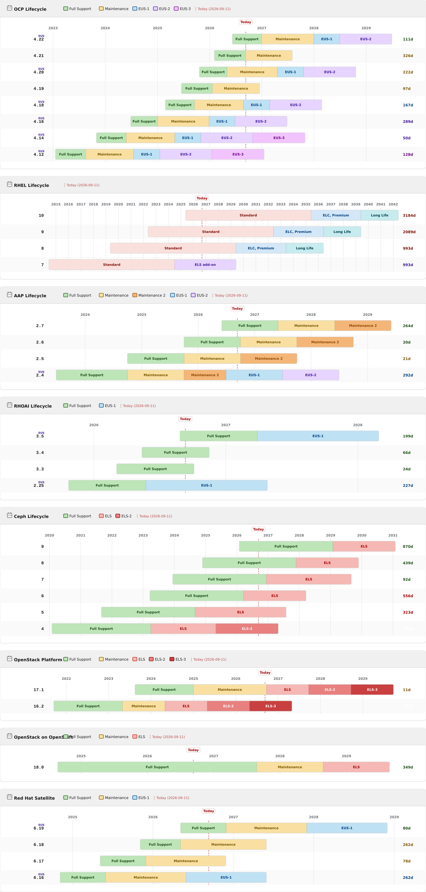

# lifecycle-graph

Standalone Python script that generates Red Hat product lifecycle Gantt charts (OCP, RHEL, AAP, RHOAI, Ceph, operators, middleware) as interactive HTML.

**One optional dependency**: `pip install pyyaml` — required for config loading from `lifecycle-config.yaml`.  
PNG export requires `rsvg-convert` (`brew install librsvg` / `apt install librsvg2-bin`).

## Preview



Per-product: [lifecycle-ocp.png](docs/lifecycle-ocp.png) · [lifecycle-rhel.png](docs/lifecycle-rhel.png) · [lifecycle-aap.png](docs/lifecycle-aap.png) · [lifecycle-rhoai.png](docs/lifecycle-rhoai.png) · [lifecycle-ceph.png](docs/lifecycle-ceph.png)

The combined chart (`--product all`) also includes **43+ OpenShift operator lifecycle charts** and middleware (JBoss EAP, JWS, Quarkus) — collapsed by default — sourced from the [Red Hat Product Life Cycles API](https://access.redhat.com/product-life-cycles/) and aligned with the [OpenShift Operator Life Cycles policy](https://access.redhat.com/support/policy/updates/openshift_operators).

Operators included: OpenShift Pipelines, GitOps, Service Mesh, Virtualization, ODF, Logging, OADP, Builds, DR Hub, cert-manager, RHACM, RHACS, OpenShift Serverless, Migration Toolkit for Virtualization, Loki, KMM, Red Hat Developer Hub, SR-IOV, Node Feature Discovery, Kubernetes NMState, Local Storage, MetalLB, VPA, NUMAresources, Windows Containers, Compliance Operator, and more.

## Quick start

```bash
pip install pyyaml

# Generate all charts into docs/ (GitHub Pages layout)
python3 lifecycle-graph.py --product all --output-dir docs
```

## Local development with Containerfile

The repo includes a `Containerfile` that pre-generates charts at build time and serves them with Flask + Gunicorn:

```bash
# Build image (generates docs/ during build)
docker build -t lifecycle-graph:local -f Containerfile .

# Run locally on port 8080
docker run --rm -p 8080:8080 lifecycle-graph:local
```

Open http://localhost:8080/ for the combined lifecycle site (`index.html`).

For live development without rebuilding the image:

```bash
pip install -r requirements.txt
python3 lifecycle-graph.py --product all --output-dir docs
python3 server.py   # serves docs/ on http://localhost:8080
```

Rebuild the container after changing `lifecycle-graph.py`, `lifecycle-config.yaml`, `static/`, or `LIFECYCLE.md`.

### Static assets (`static/`)

`static/` at the repo root is the **editable source** for CSS and icons during local development. When you run `--output-dir docs`, the script copies it to `docs/static/` — that is what GitHub Pages and `server.py` serve. You do not need a separate `static/` checkout to browse the deployed site; edit root `static/`, regenerate, and commit both `static/` and `docs/static/` changes.

## Usage

```bash
# OCP (default)
python3 lifecycle-graph.py --png

# RHEL
python3 lifecycle-graph.py --product rhel --png

# AAP
python3 lifecycle-graph.py --product aap --png

# Ceph Storage
python3 lifecycle-graph.py --product ceph --png

# All products at once (recommended)
python3 lifecycle-graph.py --product all --output-dir docs --png

# Version range (per product format)
python3 lifecycle-graph.py --product ocp  --from 4.18 --to 4.22 --png
python3 lifecycle-graph.py --product rhel --from 8 --to 10 --png
python3 lifecycle-graph.py --product aap  --from 2.4 --to 2.7 --png

# Custom output path
python3 lifecycle-graph.py --product ocp --png -o ~/Desktop/ocp.html

# Open in browser after generating
python3 lifecycle-graph.py --product rhel --png --open
```

## Options

| Flag | Default | Description |
|------|---------|-------------|
| `--product PROD` | `ocp` | Product: `ocp`, `rhel`, `aap`, `rhoai`, `ceph`, or `all` |
| `-o FILE` | `lifecycle-{product}.html` | Output HTML file |
| `--from VER` | — | Start of version range, inclusive |
| `--to VER` | — | End of version range, inclusive |
| `-v VER...` | all | Explicit version list |
| `--include-eol` | off | Include EOL versions (hidden by default) |
| `--png` | off | Also export SVG + PNG via `rsvg-convert` |
| `--width N` | `1400` | SVG/PNG width in pixels |
| `--open` | off | Open HTML in browser after generating |
| `--title TEXT` | product title | Override card header title |
| `--validate-phases` | off | Audit API `phase_map` coverage (exit 1 on gaps) |
| `--output-dir DIR` | `.` | Output directory (`docs/` for GitHub Pages) |

## Outputs

- **HTML** — interactive chart (hover tooltips on phase segments)
- **SVG** — vector source, generated natively by the script
- **PNG** — transparent background, card only; paste-safe in Google Docs / Slides

## Phase legend

| Color | Phase | Products |
|-------|-------|---------|
| Red | Standard subscription | RHEL minors/majors |
| Salmon | Premium subscription additional maintenance | RHEL minors (even) |
| Peach | Extended Life Cycle, Premium subscription additional maintenance (ELC) | RHEL minors/majors |
| Teal | Long Life add-on terms | RHEL minors/majors |
| Red | Extended life cycle support (ELS) add-on | RHEL 7 major |
| Green | Support | Ceph (single-tier) |
| Green | Full Support | OCP, AAP |
| Orange | Maintenance | OCP, AAP |
| Dark Orange | Maintenance 2 | AAP |
| Blue | EUS-1 | OCP, ODF |
| Purple | EUS-2 | OCP, ODF |
| Violet | EUS-3 | ODF |
| Pink/Red | ELS | Ceph |
| Dark Red | ELS-2 | Ceph (ELS Term 2 add-on) |
| Gray | Ext. Life | OCP |

EUS phases (Extended Update Support) only appear on even OCP/ODF releases (4.12, 4.14, …).  
RHEL uses subscription phase names from the [errata policy](https://access.redhat.com/support/policy/updates/errata), not the lifecycle API. See [LIFECYCLE.md](LIFECYCLE.md#rhel).  
Ceph uses a single "Support" tier ending at EOL, followed by optional ELS / ELS Term 2 add-on periods.

## Configuration

All product, operator, and middleware data lives in `lifecycle-config.yaml` alongside the script. To add or update a product — edit only the YAML, no Python changes needed.

```yaml
operators:
  my-op:
    api_name: "Red Hat My Operator"   # exact name from the lifecycle API
    version_strategy: xy
    min_version: "1.0"
    phase_map_preset: op-standard
```

See [LIFECYCLE.md](LIFECYCLE.md) for the full schema reference and examples.

## Data source

Fetches live from the [Red Hat Product Life Cycles API](https://access.redhat.com/product-life-cycles/api/v1/products).  
Falls back to `fallback:` blocks in `lifecycle-config.yaml` only when the API is unreachable.

**API-first rule:** when the API returns a version, only API-provided phases are used — `fallback:` is not merged field-by-field.

**RHEL exception:** dates come from `rhel_majors` / `rhel_minors` in YAML (the API phase names and dates are inaccurate for the subscription model).

Validate phase coverage before changing products:

```bash
python3 lifecycle-graph.py --validate-phases
```

## GitHub Actions

The workflow at [`.github/workflows/update-lifecycle.yml`](.github/workflows/update-lifecycle.yml) keeps all charts up to date automatically.

### Triggers

| Trigger | When |
|---------|------|
| **Schedule** | Daily at 06:00 UTC |
| **Push** | On any push to `main` that modifies `lifecycle-graph.py`, `lifecycle-config.yaml`, or `LIFECYCLE.md` |
| **Manual** | Via GitHub UI → Actions → *Update Lifecycle Charts* → Run workflow |

### What it does

1. Checks out the repo
2. Installs `pyyaml` and `librsvg2-bin`
3. Runs `python3 lifecycle-graph.py --product all --output-dir docs --png` — fetches live data, generates HTML + SVG + PNG for all products
4. Commits and pushes updated files only if the chart data changed

### Setup

No secrets needed. The workflow uses the default `GITHUB_TOKEN` with `contents: write` permission, which is granted automatically.

```bash
# First-time push to activate the workflow
git add .github/workflows/update-lifecycle.yml lifecycle-graph.py
git commit -m "ci: add lifecycle charts auto-update workflow"
git push
```
